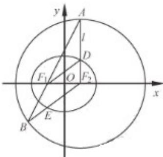

<!-- question-source:start -->
17.如图，在平面直角坐标系 $xOy$ 中，椭圆 $C: \frac{x^2}{a^2} + \frac{y^2}{b^2} = 1 (a > b > 0)$ 的焦点为 $F_1(-1, 0)$ ，

$F_{2}(1,0)$ .过 $F_{2}$ 作 $x$ 轴的垂线 $l$ ，在 $x$ 轴的上方， $l$ 与圆 $F_{2}: (x - 1)^{2} + y^{2} = 4a^{2}$ 交于点 $A$ ，与椭圆 $C$ 交于点 $D.$ 连

结 $AF_{1}$ 并延长交圆 $F_{2}$ 于点 $B$ ，连结 $BF_{2}$ 交椭圆 $C$ 于点 $E$ ，连结 $DF_{1}$ ．已知 $DF_{1} = \frac{5}{2}$

<!-- question-source:end -->

![[高中/真题/按年份分类/2019/2019年江苏高考数学试题及答案/解答题/题目/answers/Q00028983A1.md]]
