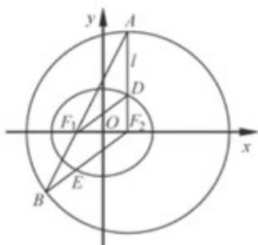

> [!faq]- 2019年江苏高考数学试题及答案解析
>
> > [!success]- **【答案】** （1） $\frac{x^{2}}{4}+\frac{y^{2}}{3}=1;$ (2) $E(-1, -\frac{3}{2})$ . 【
>
> > [!note]- **【分析】**
> > (1)由题意分别求得 a, b 的值即可确定椭圆方程；
>
> > [!note]- **【解析】**
> > （1）设椭圆 $C$ 的焦距为 $2c$ .
> >
> > 因为 $F_{1}(-1,0)$ ， $F_{2}(1,0)$ ，所以 $F_{1}F_{2}=2$ ，c=1.
> >
> > 又因为 $DF_{1}=\frac{5}{2}$ ， $AF_{2}\perp x$ 轴，所以 $DF_{2}=\sqrt{DF_{1}^{2}-F_{1}F_{2}^{2}}=\sqrt{\left(\frac{5}{2}\right)^{2}-2^{2}}=\frac{3}{2}$
> >
> > 因此 $2a = DF_{1} + DF_{2} = 4$ ，从而 $a = 2$
> >
> > 由 $b^{2} = a^{2} - c^{2}$ ，得 $b^{2} = 3$
> >
> > 因此，椭圆 C 的标准方程为 $\frac{x^{2}}{4} + \frac{y^{2}}{3} = 1$ .
> >
> > (2) 解法一:
> >
> > 由（1）知，椭圆 C: $\frac{x^{2}}{4}+\frac{y^{2}}{3}=1$ ，a=2，
> >
> > 因为 $AF_{2} \perp x$ 轴，所以点 $A$ 的横坐标为1.
> >
> > 将 x=1 代入圆 $F_{2}$ 的方程 $(x-1)^{2}+y^{2}=16$ ，解得 $y=\pm4$ .
> >
> > 
> >
> > 因为点 A 在 x 轴上方，所以 $A(1, 4)$ .
> >
> > 又 $F_{1}(-1,0)$ ，所以直线 $AF_{1}: y=2x+2$ .
> >
> > 由 $\left\{\begin{aligned}y&=2x+2\\ (x-1)^{2}&=y^{2}=16\end{aligned}\right.$ ，得 $5x^{2}+6x-11=0$ ，
> >
> > 解得 x=1 或 $x=-\frac{11}{5}$ .
> >
> > 将 $x = -\frac{11}{5}$ 代入 $y = 2x + 2$ ，得 $y = -\frac{12}{5}$ ，
> >
> > 因此 $B(-\frac{11}{5}, - \frac{12}{5})$ .又 $F_{2}(1,0)$ ，所以直线 $BF_{2}$ ： $y = \frac{3}{4} (x - 1)$
> >
> > 由 $\left\{\begin{aligned}y&=\frac{3}{4}(x-1)\\ \frac{x^{2}}{4}+\frac{y^{2}}{3}&=1\end{aligned}\right.$ ，得，解得或 $x=\frac{13}{7}$
> >
> > 又因为 E 是线段 $BF_{2}$ 与椭圆的交点，所以 x = -1.
> >
> > 将 $x = -1$ 代入 $y = \frac{3}{4} (x - 1)$ ，得 $y = -\frac{3}{2}$ 。因此 $E(-1, -\frac{3}{2})$ 。
> >
> > 解法二：
> >
> > 由（1）知，椭圆 $C: \frac{x^2}{4} + \frac{y^2}{3} = 1$ 。如图，连结 $EF_1$ 。
> >
> > 
> >
> > 因为 $BF_{2}=2a$ ， $EF_{1}+EF_{2}=2a$ ，所以 $EF_{1}=EB$ ，
> >
> > 从而 $\angle BF_{1}E = \angle B.$
> >
> > 因为 $F_{2}A=F_{2}B$ ，所以 $\angle A=\angle B$ ，
> >
> > 所以 $\angle A = \angle BF_{1}E$ ，从而 $EF_{1}\| F_{2}A.$
> >
> > 因为 $AF_{2} \perp x$ 轴，所以 $EF_{1} \perp x$ 轴.
> >
> > 因为 $F_{1}(-1,0)$ ，由 $\left\{\begin{aligned}x&=-1\\ \frac{x^{2}}{4}&+\frac{y^{2}}{3}=1\end{aligned}\right.$ ，得 $y=\pm\frac{3}{2}$ .
> >
> > 又因为 E 是线段 $BF_{2}$ 与椭圆的交点，所以 $y = -\frac{3}{2}$ .
> >
> > 因此 $E(-1, -\frac{3}{2})$
> >
> > 【点睛】本题主要考查直线方程、圆的方程、椭圆方程、椭圆的几何性质、直线与圆及椭圆的位置关系等基础知识，考查推理论证能力、
