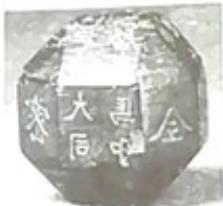
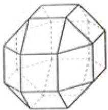

<!-- question-source:start -->
16. 中国有悠久的金石文化, 印信是金石文化的代表之一。印信的形状多为长方体、正方体或圆柱体, 但南北朝时期的官员独孤信的印信形状是 “半正多面体” (图 1)。半正多面体是由两种或两种以上的正多边形围成的多面体。半正多面体体现了数学的对称美。图 2 是一个棱数为 48 的半正多面体, 它的所有顶点都在同一个正方体的表面上, 且此正方体的棱长为 1。则该半正多面体共有\_\_\_\_个面, 其棱长为\_\_\_\_。（本题第一空 2 分, 第二空 3 分。）

  
图1

  
图2
<!-- question-source:end -->

![[高中/真题/按年份分类/2019/2019年海南省高考文科数学试题及答案/填空题/题目/answers/Q00027563A1.md]]
