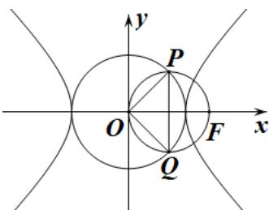

> [!faq]- 2019年理科数学海南省高考真题含答案解析
>
> > [!success]- **【答案】** A
>
> > [!note]- **【分析】**
> > 本题未单列分析。
>
> > [!note]- **【解析】**
> > $$
> > \therefore | P Q | \neq O F | = c, \therefore \angle P O Q = 9 0 ^ {\circ},
> > $$
> >
> > $$
> > \text {又} \mid O P \mid \nexists O Q \mid = a, \therefore a ^ {2} + a ^ {2} = c ^ {2}
> > $$
> >
> > 解得 $\frac{c}{a} = \sqrt{2}$ ，即 $e = \sqrt{2}$
> >
> > 
