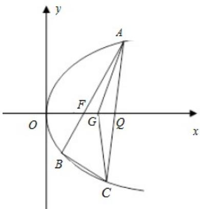

<!-- question-source:start -->
21.如图，已知点 $F
(10)$ 为抛物线 $y^{2}=2px(p>0)$ ，点F为焦点，过点F的直线交抛物线于 $^{A,B}$ 两点，点C
在抛物线上，使得 $\forall ABC$ 的重心 $^{G}$ 在 $^{x}$ 轴上，直线 $AC_{交^{x}}$ 轴于点 $^{Q}$ ，且 $^{Q}$ 在点 $^{F}$ 右侧.记 $\triangle AFG, \triangle CQG$ 的面积为 $S_{1}, S_{2}$ .

(1) 求 $p$ 的值及抛物线的标准方程;

(2) 求 $\frac{S_{1}}{S_{2}}$ 的最小值及此时点 G 的坐标.
<!-- question-source:end -->

![[高中/真题/按年份分类/2019/2019年高考浙江高考数学试题及答案_精校版_/填空题/题目/answers/Q00029596A1.md]]
