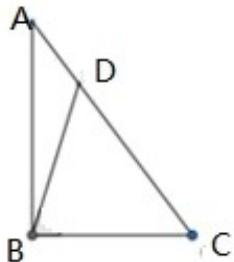

> [!faq]- 2019年高考浙江高考数学试题及答案(精校版)解析
>
> > [!success]- **【答案】** (1). $\frac{12\sqrt{2}}{5}$ (2). $\frac{7\sqrt{2}}{10}$
>
> > [!note]- **【分析】**
> > 本题主要考查解三角形问题，即正弦定理、三角恒等变换、数形结合思想及函数方程思想.通过引入
>
> > [!note]- **【解析】**
> > 在 $\Delta ABD$ 中，正弦定理有： $\frac{AB}{\sin\angle ADB} = \frac{BD}{\sin\angle BAC}$ ，而 $AB = 4,\angle ADB = \frac{3\pi}{4}$
> >
> > $AC=\sqrt{AB^{2}+BC^{2}}=5,\quad\sin\angle BAC=\frac{BC}{AC}=\frac{3}{5},\cos\angle BAC=\frac{AB}{AC}=\frac{4}{5},$ 所以 $BD=\frac{12\sqrt{2}}{5}$ .
> >
> > $$
> > \cos \angle A B D = \cos (\angle B D C - \angle B A C) = \cos \frac {\pi}{4} \cos \angle B A C + \sin \frac {\pi}{4} \sin \angle B A C = \frac {7 \sqrt {2}}{1 0}
> > $$
> >
> > 
> >
> > 【点睛】解答解三角形问题，要注意充分利用图形特征.
