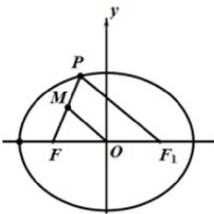

> [!faq]- 2019年高考浙江高考数学试题及答案(精校版)解析
>
> > [!success]- **【答案】** $\sqrt{15}$
>
> > [!note]- **【分析】**
> > 结合图形可以发现，利用三角形中位线定理，将线段长度用坐标表示考点圆的方程，与椭圆方程联立可进一步求解.利用焦半径及三角形中位线定理，则更为简洁.
>
> > [!note]- **【解析】**
> > 方法1：由题意可知 $|OF|=|OM|=c=2$ ，
> >
> > 由中位线定理可得 $\left|PF_{1}\right|=2\left|OM\right|=4$ ，设 $P(x,y)$ 可得 $(x-2)^{2}+y^{2}=16$ ，
> >
> > 联立方程 $\frac{x^2}{9} +\frac{y^2}{5} = 1$
> >
> > 可解得 $x = -\frac{3}{2}, x = \frac{21}{2}$ （舍），点 $P$ 在椭圆上且在 $x$ 轴的上方，
> >
> > 求得 $P\left(-\frac{3}{2},\frac{\sqrt{15}}{2}\right)$ ，所以 $k_{PF}=\frac{\frac{\sqrt{15}}{2}}{\frac{1}{2}}=\sqrt{15}$
> >
> > 
> >
> > 方法 2：焦半径公式应用
