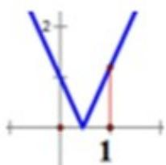

> [!faq]- 2019年高考浙江高考数学试题及答案(精校版)解析
>
> > [!success]- **【答案】** $a_{max}=\frac{4}{3}$
>
> > [!note]- **【分析】**
> > 本题主要考查含参绝对值不等式、函数方程思想及数形结合思想，属于能力型考题.从研究$f(t + 2) - f(t) = 2a(3t^2 +6t + 4) - 2$ 入手，令 $m = 3t^2 +6t + 4\in [1, + \infty)$ ，从而使问题加以转化，通过绘制函数图象，观察得解.
>
> > [!note]- **【解析】**
> > 使得 $f(t + 2) - f(t) = a(2\bullet (t + 2)^2 +t(t + 2) + t^2)) - 2 = 2a(3t^2 +6t + 4) - 2,$
> >
> > 使得令 $m = 3t^2 + 6t + 4 \in [1, +\infty)$ ，则原不等式转化为存在 $m \geq 1, |am - 1| \leq \frac{1}{3}$ ，由折线函数，如图
> >
> > 
> >
> > 只需 $a - 1 \leq \frac{1}{3}$ ，即 $a \leq \frac{4}{3}$ ，即 $a$ 的最大值是 $\frac{4}{3}$
> >
> > 【点睛】对于函数不等式问题，需充分利用转化与化归思想、数形结合思想.
