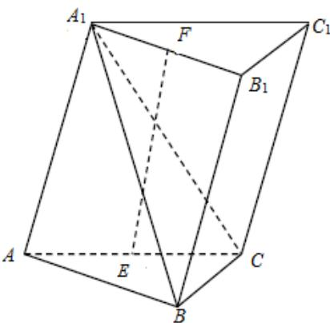

<!-- question-source:start -->
19.如图，已知三棱柱 $ABC - A_{1}B_{1}C_{1}$ ，平面 $A_{1}AC_{1}C \perp$ 平面 $ABC, \angle ABC = 90^{\circ}$

$\angle BAC = 30^{\circ}, A_{1}A = A_{1}C = AC, E, F$ 分别是 $AC, A_{1}B_{1}$ 的中点.

(1) 证明: $EF \perp BC$ ;

(2) 求直线 $EF$ 与平面 $A_{1}BC$ 所成角的余弦值.
<!-- question-source:end -->

![[高中/真题/按年份分类/2019/2019年高考浙江高考数学试题及答案_精校版_/解答题/题目/answers/Q00022752A1.md]]
