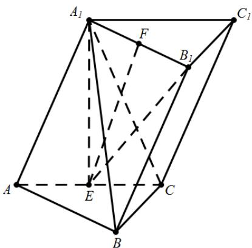
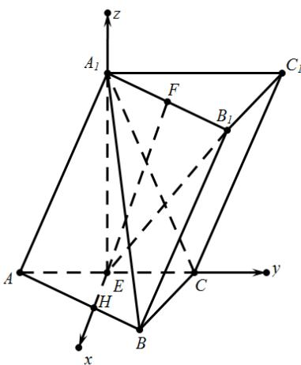

> [!faq]- 2019年高考浙江高考数学试题及答案(精校版)解析
>
> > [!success]- **【答案】** （1）证明见
>
> > [!note]- **【分析】**
> > (1)由题意首先证得线面垂直，然后利用线面垂直的定义即可证得线线垂直；
>
> > [!note]- **【解析】**
> > (1)如图所示，连结 $A_{1}E, B_{1}E$ ，
> >
> > 
> >
> > 等边 $\triangle AA_{1}C$ 中， $AE = EC$ ，则 $\because \sin B\neq 0,\therefore \sin A = \frac{\sqrt{3}}{2},$
> >
> > 平面 $ABC \perp$ 平面 $A_{1}ACC_{1}$ ，且平面 $ABC \cap$ 平面 $A_{1}ACC_{1} = AC$
> >
> > 由面面垂直的性质定理可得： $A_{1}E \perp$ 平面 ABC，故 $A_{1}E \perp BC$ ，
> >
> > 由三棱柱的性质可知 $A_{1}B_{1}\parallel AB$ ，而 $AB\perp BC$ ，故 $A_{1}B_{1}\perp BC$ ，且 $A_{1}B_{1}\cap A_{1}E = A_{1}$
> >
> > 由线面垂直的判定定理可得： $BC \perp_{\text{平面}} A_{1} B_{1} E$
> >
> > 结合 $EF \subseteq$ 平面 $A_{1}B_{1}E$ ，故 $EF \perp BC$ .
> >
> > (2)在底面 ABC 内作 $EH \perp AC$ ，以点 E 为坐标原点， $EH, EC, EA_{1}$ 方向分别为 x, y, z 轴正方向建立空间直角坐标系 $E - xyz$ .
> >
> > 
> >
> > 设 $EH = 1$ ，则 $AE = EC = \sqrt{3}$ ， $AA_{1} = CA_{1} = 2\sqrt{3}$ ， $BC = \sqrt{3}, AB = 3$
> >
> > 据此可得： $A(0, -\sqrt{3}, 0), B\left(\frac{3}{2}, \frac{\sqrt{3}}{2}, 0\right), A_1(0, 0, 3), C(0, \sqrt{3}, 0)$ ，
> >
> > 由 $AB = A_{1}B_{1}$ 可得点 $B_{1}$ 的坐标为 $B_{1}\left(\frac{3}{2},\frac{3}{2}\sqrt{3},3\right)$
> >
> > 利用中点坐标公式可得： $F\left(\frac{3}{4},\frac{3}{4}\sqrt{3},3\right)$ ，由于 $E(0,0,0)$ ，
> >
> > 故直线 EF 的方向向量为： $EF = \left( \frac{3}{4}, \frac{3}{4} \sqrt{3}, 3 \right)$
> >
> > 设平面 $A_{1}BC$ 的法向量为 $m = (x,y,z)$ ，则：
> >
> > $$
> > \left\{ \begin{array}{l} m \cdot A _ {1} B = (x, y, z) \cdot \left(\frac {3}{2}, \frac {\sqrt {3}}{2}, - 3\right) = \frac {3}{2} x + \frac {\sqrt {3}}{2} y - 3 z = 0 \\ m \cdot B C = (x, y, z) \cdot \left(- \frac {3}{2}, \frac {\sqrt {3}}{2}, 0\right) = - \frac {3}{2} x + \frac {\sqrt {3}}{2} y = 0 \end{array} , \right.
> > $$
> >
> > 据此可得平面 $A_{1}BC$ 的一个法向量为 $m = (1, \sqrt{3}, 1)$ , $EF = \left(\frac{3}{4}, \frac{3}{4}\sqrt{3}, 3\right)$
> >
> > 此时 $\cos\left\langle EF,m\right\rangle=\frac{EF\cdot m}{\left|EF\right|\times\left|m\right|}=\frac{6}{\sqrt{5}\times\frac{3\sqrt{5}}{2}}=\frac{4}{5}$
> >
> > 设直线 $EF$ 与平面 $A_{1}BC$ 所成角为 $\theta$ ，则 $\sin \theta = \cos \left\langle EF, m \right\rangle = \frac{4}{5}, \cos \theta = \frac{3}{5}$ .
> >
> > 【点睛】本题考查了立体几何中的线线垂直的判定和线面角的求解问题，意在考查学生的空间想象能力和逻辑推理能力；
