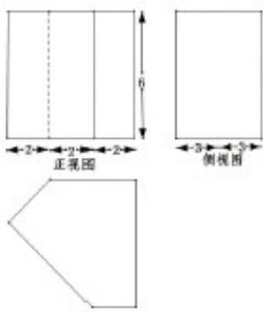

<!-- question-source:start -->
4.祖暅是我国南北朝时代的伟大科学家.他提出的“幂势既同，则积不容易”称为祖暅原理，利用该原理可以得到柱体体积公式 $V_{\text{柱体}} = Sh$ ，其中 $S$ 是柱体的底面积， $h$ 是柱体的高，若某柱体的三视图如图所示，则该柱体的体积是（）

  
俯视图

A. 158 B. 162 C. 182 D. 32
<!-- question-source:end -->

![[高中/真题/按年份分类/2019/2019年高考浙江高考数学试题及答案_精校版_/选择题/题目/answers/Q00022737A1.md]]
