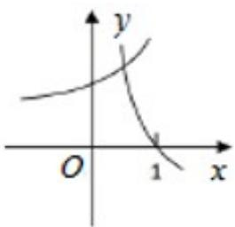
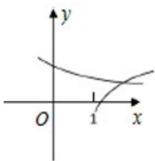
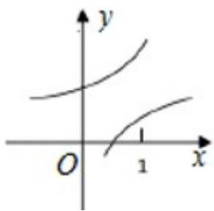
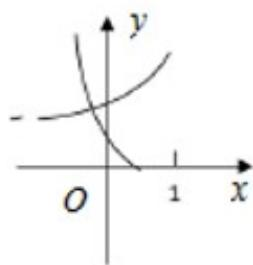

<!-- question-source:start -->
6.在同一直角坐标系中，函数 $y = \frac{1}{a^x}, y = \log_a\left(x + \frac{1}{2}\right) (a > 0 \text{且} a \neq 0)$ 图象可能是（）

A.

B.

C.

D.

<!-- question-source:end -->

![[高中/真题/按年份分类/2019/2019年高考浙江高考数学试题及答案_精校版_/选择题/题目/answers/Q00022739A1.md]]
