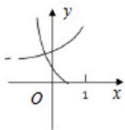

> [!faq]- 2019年高考浙江高考数学试题及答案(精校版)解析
>
> > [!success]- **【答案】** D 【
>
> > [!note]- **【分析】**
> > D.  
> > 
>
> > [!note]- **【解析】**
> > 当 $0 < a < 1$ 时，函数 $y = a^{x}$ 过定点 $(0,1)$ 且单调递减，则函数 $y = \frac{1}{a^x}$ 过定点 $(0,1)$ 且单调递增，
> >
> > 函数 $y = \log_a\left(x + \frac{1}{2}\right)$ 过定点 $(\frac{1}{2},0)$ 且单调递减，D选项符合；当 $a > 1$ 时，函数 $y = a^x$ 过定点 $(0,1)$ 且单调
> >
> > 递增，则函数 $y=\frac{1}{a^{x}}$ 过定点 $(0,1)$ 且单调递减，函数 $y=\log_{a}\left(x+\frac{1}{2}\right)$ 过定点 $(\frac{1}{2},0)$ 且单调递增，各选项均不符合.综上，选 D.
> >
> > 【点睛】易出现的错误有，一是指数函数、对数函数的图象和性质掌握不熟，导致判断失误；二是不能通过讨论 $a$ 的不同取值范围，认识函数的单调性.
