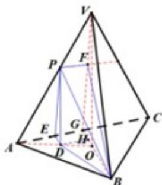

> [!faq]- 2019年高考浙江高考数学试题及答案(精校版)解析
>
> > [!success]- **【答案】** B
>
> > [!note]- **【分析】**
> > 本题以三棱锥为载体，综合考查异面直线所成的角、直线与平面所成的角、二面角的概念，以及各种角的计算.解答的基本方法是通过明确各种角，应用三角函数知识求解，而后比较大小.而充分利用图形特征，则可事倍功半.
>
> > [!note]- **【解析】**
> > 方法1：如图 $G$ 为 $AC$ 中点， $V$ 在底面 $ABC$ 的投影为 $O$ ，则 $P$ 在底面投影 $D$ 在线段 $AO$ 上，过
> >
> > $D$ 作 $DE$ 垂直 $AE$ ，易得 $PE // VG$ ，过 $P$ 作 $PF // AC$ 交 $VG$ 于 $F$ ，过 $D$ 作 $DH // AC$ ，交 $BG$ 于 $H$ ，
> >
> > 则 $\alpha = \angle BPF, \beta = \angle PBD, \gamma = \angle PED$ ，则 $\cos \alpha = \frac{PF}{PB} = \frac{EG}{PB} = \frac{DH}{PB} < \frac{BD}{PB} = \cos \beta$ ，即 $\alpha > \beta$ ，
> >
> > $\tan \gamma = \frac{PD}{ED} >\frac{PD}{BD} = \tan \beta$ ，即 $y > \beta$ ，综上所述，答案为B.
> >
> > 
> >
> > 方法2：由最小角定理 $\beta < \alpha$ ，记 $V - AB - C$ 的平面角为 $\gamma^{\prime}$ （显然 $\gamma^{\prime} = \gamma$ ）
> >
> > 由最大角定理 $\beta < \gamma' = \gamma$ ，故选 B.
> >
> > 法 2: （特殊位置）取 V - ABC 为正四面体，P 为 VA 中点，易得
> >
> > $\cos \alpha = \frac{\sqrt{3}}{6} \Rightarrow \sin \alpha = \frac{\sqrt{33}}{6}, \sin \beta = \frac{\sqrt{2}}{3}, \sin \gamma = \frac{2\sqrt{2}}{3}$ ，故选B.
> >
> > 【点睛】常规解法下易出现的错误有，不能正确作图得出各种角.未能想到利用“特殊位置法”，寻求简便解法.
