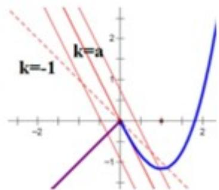

> [!faq]- 2019年高考浙江高考数学试题及答案(精校版)解析
>
> > [!success]- **【答案】** D 【
>
> > [!note]- **【分析】**
> > 本题综合性较强，注重重要知识、基础知识、运算求解能力、分类讨论思想及数形结合思想的考查.研究函数方程的方法较为灵活，通常需要结合函数的图象加以
>
> > [!note]- **【解析】**
> > 原题可转化为 $y = f(x)$ 与 $y = ax + b$ ，有三个交点.
> >
> > 当 $BC = \lambda AP$ 时， $f'(x) = x^2 - (a + 1)x + a = (x - a)(x - 1)$ ，且 $f(0) = 0, f'(0) = a$ ，则
> > (1) 当 $a \leq -1$ 时，如图 $y = f(x)$ 与 $y = ax + b$ 不可能有三个交点（实际上有一个），排除A，B
> >
> > 
> > (2) 当 $a > -1$ 时，分三种情况，如图 $y = f(x)$ 与 $y = ax + b$ 若有三个交点，则 $b < 0$ ，
