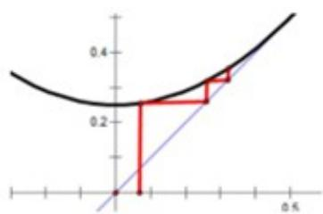

> [!faq]- 2019年高考浙江高考数学试题及答案(精校版)解析
>
> > [!success]- **【答案】** A
>
> > [!note]- **【分析】**
> > 本题未单列分析。
>
> > [!note]- **【解析】**
> > 选项B：不动点满足 $x^{2} - x + \frac{1}{4} = \left(x - \frac{1}{2}\right)^{2} = 0$ 时，如图，若 $a_{1} = a\in \left(0,\frac{1}{2}\right),\quad a_{n} <   \frac{1}{2},$
> >
> > 排除
> >
> > 
> >
> > 如图，若 $a$ 为不动点 $\frac{1}{2}$ 则 $a_{n} = \frac{1}{2}$
> >
> > 选项C：不动点满足 $x^{2} - x - 2 = \left(x - \frac{1}{2}\right)^{2} - \frac{9}{4} = 0$ ，不动点为 $\frac{\mathrm{ax} - 1}{2}$ ，令 $a = 2$ ，则 $a_{n} = 2 <   10$ 排除
> >
> > 选项D：不动点满足 $x^{2} - x - 4 = \left(x - \frac{1}{2}\right)^{2} - \frac{17}{4} = 0$ ，不动点为 $x = \frac{\sqrt{17}}{2} \pm \frac{1}{2}$ ，令 $a = \frac{\sqrt{17}}{2} \pm \frac{1}{2}$ ，则 $a_{n} = \frac{\sqrt{17}}{2} \pm \frac{1}{2} < 10$ ，排除.
> >
> > 选项A：证明：当 $b = \frac{1}{2}$ 时， $a_{2} = a_{1}^{2} + \frac{1}{2}\geq \frac{1}{2},\quad a_{3} = a_{2}^{2} + \frac{1}{2}\geq \frac{3}{4},\quad a_{4} = a_{3}^{2} + \frac{1}{2}\geq \frac{17}{16}\geq 1,$
> >
> > 处理一：可依次迭代到 $a_{10}$ ;
> >
> > 处理二：当 $n\geq 4$ 时， $a_{n + 1} = a_n^2 +\frac{1}{2}\geq a_n^2\geq 1$ ，则则
> >
> > $$
> > a _ {n + 1} \geq \left(\frac {1 7}{1 6}\right) ^ {2 ^ {n - 1}} (n \geq 4), \text {则} a _ {1 0} \geq \left(\frac {1 7}{1 6}\right) ^ {2 ^ {6}} = \left(1 + \frac {1}{1 6}\right) ^ {6 4} = 1 + \frac {6 4}{1 6} + \frac {6 4 \times 6 3}{2} \times \frac {1}{1 6 ^ {2}} + \dots > 1 + 4 + 7 > 1 0.
> > $$
> >
> > 故选A
> >
> > 【点睛】遇到此类问题，不少考生会一筹莫展.利用函数方程思想，通过研究函数的不动点，进一步讨论 $a$ 的可能取值，利用“排除法”求解.
> >
> > ## 非选择题部分（共110分）
> >
> > ## 二、填空题：本大题共7小题，多空题每题6分，单空题每题4分，共36分
