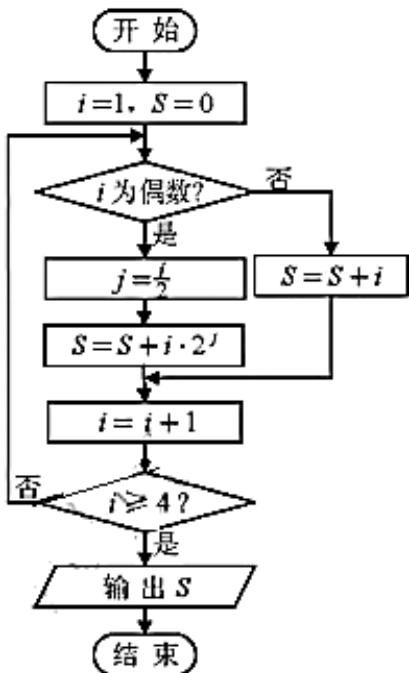

# 2019年普通高等学校招生全国统一考试（天津卷）

1. 数学（理工类）

本试卷分为第Ⅰ卷（选择题）和第Ⅱ卷（非选择题）两部分，共150分，考试用时120分钟。第Ⅰ卷1至2页，第Ⅱ卷3至5页。

答卷前，考生务必将自己的姓名、准考号填写在答题卡上，并在规定位置粘贴考试用条形码。答卷时，考生务必将答案涂写在答题卡上，答在试卷上的无效。考试结束后，将本试卷和答题卡一并交回。

祝各位考生考试顺利！

## 第1卷

## 注意事项：

1. 每小题选出答案后, 用铅笔将答题卡上对应题目的答案标号涂黑。如需改动, 用橡皮擦干净后, 再选涂其他答案标号。

2. 本卷共8小题，每小题5分，共40分。

参考公式:

·如果事件 $A$ 、 $B$ 互斥，那么 $P(A \cup B) = P(A) + P(B)$ ·
·如果事件 $A$ 、 $B$ 相互独立，那么 $P(AB) = P(A)P(B)$ ·
·圆柱的体积公式 $V = Sh$ ，其中 $S$ 表示圆柱的底面面积， $h$ 表示圆柱的高。
·棱锥的体积公式 $V = \frac{1}{3}Sh$ ，其中 $S$ 表示棱锥的底面面积， $h$ 表示棱锥的高。

##
一、选择题：在每小题给出的四个选项中，只有一项是符合题目要求的.

1. 设集合 $A = \{-1, 1, 2, 3, 5\}, B = \{2, 3, 4\}, C = \{x \in \mathbf{R} \mid 1 \leq x < 3\}$ ，则 $(A \cap C) \cup B =$ A. $\{2\}$ B. $\{2, 3\}$ C. $\{-1, 2, 3\}$ D. $\{1, 2, 3, 4\}$

2. 设变量 $x, y$ 满足约束条件 $\left\{ \begin{array}{l} x + y - 2 \leq 0, \\ x - y + 2 \geq 0, \\ x \geq -1, \\ y \geq -1, \end{array} \right.$ 则目标函数 $z = -4x + y$ 的最大值为 A. 2 B. 3 C. 5 D. 6

3. 设 $x \in \mathbf{R}$ , 则 “ $x^2 - 5x < 0$ ” 是 “ $|x - 1| < 1$ ” 的
A. 充分而不必要条件 B. 必要而不充分条件
C. 充要条件 D. 既不充分也不必要条件

4. 阅读下边的程序框图，运行相应的程序，输出 $S$ 的值为

A. 5 B. 8 C. 24 D. 29

5. 已知抛物线 $y^{2} = 4x$ 的焦点为 $F$ ，准线为 $l$ ，若 $l$ 与双曲线 $\frac{x^2}{a^2} - \frac{y^2}{b^2} = 1 \quad (a > 0, b > 0)$ 的两条渐近线分别交于点 $A$ 和点 $B$ ，且 $|AB| = 4|OF|$ （ $O$ 为原点），则双曲线的离心率为
A. $\sqrt{2}$ B. $\sqrt{3}$ C. 2    D. $\sqrt{5}$

6. 已知 $a = \log_5 2, b = \log_{0.5} 0.2, c = 0.5^{0.2}$ ，则 $a, b, c$ 的大小关系为
A. $a < c < b$ B. $a < b < c$ C. $b < c < a$ D. $c < a < b$

7. 已知函数 $f(x) = A\sin (\omega x + \varphi)(A > 0, \omega > 0, |\varphi| < \pi)$ 是奇函数，将 $y = f(x)$ 的图象上所有点的横坐标伸长到原来的2倍（纵坐标不变），所得图象对应的函数为 $g(x)$ . 若 $g(x)$ 的最小正周期为 $2\pi$ ，且$g\left(\frac{\pi}{4}\right) = \sqrt{2}$ ，则 $f\left(\frac{3\pi}{8}\right) =$ A. -2 B. $-\sqrt{2}$ C. $\sqrt{2}$ D. 2

8. 已知 $a \in \mathbf{R}$ ，设函数 $f(x) = \begin{cases} x^2 - 2ax + 2a, & x \leq 1, \\ x - a\ln x, & x > 1. \end{cases}$ 若关于 $x$ 的不等式 $f(x) \geq 0$ 在 $\mathbf{R}$ 上恒成立，则 $a$ 的取值范围为
A. [0,1] B. [0,2] C. [0,e] D. [1,e]

# 2019 年普通高等学校招生全国统一考试（天津卷）

# 数学（理工类）

第Ⅱ卷

## 注意事项：

1. 用黑色墨水的钢笔或签字笔将答案写在答题卡上。

2. 本卷共12小题，共110分。

##

![[高中/真题/按年份分类/2019/2019年高考理科数学试题_天津卷_及参考答案/填空题/填空题.md]]
![[高中/真题/按年份分类/2019/2019年高考理科数学试题_天津卷_及参考答案/解答题/解答题.md]]
![[高中/真题/按年份分类/2019/2019年高考理科数学试题_天津卷_及参考答案/选择题/选择题.md]]
