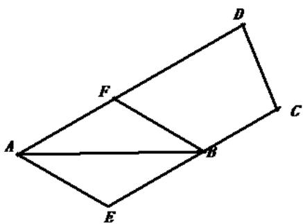
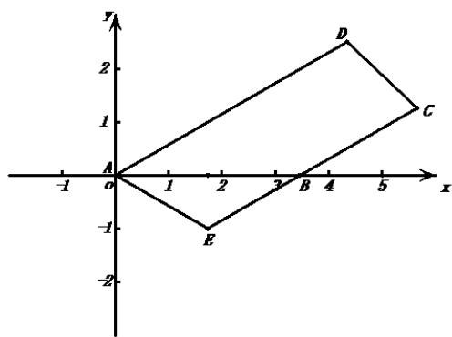

> [!faq]- 2019年高考理科数学试题(天津卷)及参考答案解析
>
> > [!success]- **【答案】** -1 【
>
> > [!note]- **【分析】**
> > 可利用向量的线性运算，也可以建立坐标系利用向量的坐标运算求解。
>
> > [!note]- **【解析】**
> > 解法一：如图，过点 B 作 AE 的平行线交 AD 于 F，
> >
> > 因为 AE = BE ，故四边形 AEBF 为菱形。
> >
> > 因为 $\angle BAD = 30^{\circ}$ ， $AB = 2\sqrt{3}$ ，所以 $AF = 2$ ，即 $AF = \frac{2}{5} AD$
> >
> > 因为 $AE = FB = AB - AF = AB - \frac{2}{5} AD$ ,
> >
> > 所以 $BD \square AE = (AD - AB) \square (AB - \frac{2}{5} AD) = \frac{7}{5} AB \square AD - AB^{2} - \frac{2}{5} AD^{2} = \frac{7}{5} \times 2\sqrt{3} \times 5 \times \frac{\sqrt{3}}{2} - 12 - 10 = -1.$
> >
> > 
> >
> > 解法二：建立如图所示的直角坐标系，则 $B(2\sqrt{3},0)$ ， $D(\frac{5\sqrt{3}}{2},\frac{5}{2})$ 。
> >
> > 因为 $AD \parallel BC$ ， $\angle BAD = 30^{\circ}$ ，所以 $\angle CBE = 30^{\circ}$ ，
> >
> > 因为 AE = BE ，所以 $\angle BAE = 30^{\circ}$ ，
> >
> > 所以直线 $BE$ 的斜率为 $\frac{\sqrt{3}}{3}$ ，其方程为 $y=\frac{\sqrt{3}}{3}(x-2\sqrt{3})$ ，
> >
> > 直线 $AE$ 的斜率为 $-\frac{\sqrt{3}}{3}$ ，其方程为 $y = -\frac{\sqrt{3}}{3} x$ 。
> >
> > 由 $\left\{ \begin{array}{ll}y = \frac{\sqrt{3}}{3} (x - 2\sqrt{3}),\\ y = -\frac{\sqrt{3}}{3} x & \text{得} \quad ,\quad ,\\ x = \sqrt{3} & y = -1 \end{array} \right.$
> >
> > 所以 $E(\sqrt{3}, -1)$
> >
> > 所以 $BD \square AE = \left( \frac{\sqrt{3}}{2}, \frac{5}{2} \right) \square (\sqrt{3}, -1) = -1$ 。
> >
> > 
> >
> > 【点睛】平面向量问题有两大类解法：基向量法和坐标法，在便于建立坐标系的问题中使用坐标方法更为方便。
> > 三.解答题.
