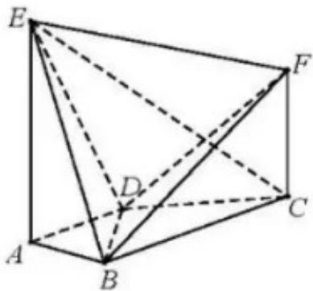

<!-- question-source:start -->
17. （本小题满分 13 分）

如图， $AE \perp$ 平面ABCD， $CF\parallel AE, \quad AD\parallel BC, \quad AD \perp AB, \quad AB = AD = 1, \quad AE = BC = 2.$

（Ⅰ）求证： $BF \parallel$ 平面 ADE；

（Ⅱ）求直线 CE 与平面 BDE 所成角的正弦值；

（III）若二面角 $E - BD - F$ 的余弦值为 $\frac{1}{3}$ ，求线段 $CF$ 的长.

## 18. （本小题满分 13 分）

设椭圆 $\frac{x^2}{a^2} +\frac{y^2}{b^2} = 1(a > b > 0)$ 的左焦点为 $F$ ，上顶点为 $B$ ．已知椭圆的短轴长为4，离心率为 $\frac{\sqrt{5}}{5}$

（Ⅰ）求椭圆的方程；

（Ⅱ）设点 $P$ 在椭圆上，且异于椭圆的上、下顶点，点 $M$ 为直线 $PB$ 与 $x$ 轴的交点，点 $N$ 在 $y$ 轴的负半轴

上．若 $|ON|\neq OF|$ （O为原点），且 $OP\perp MN$ ，求直线PB的斜率.
<!-- question-source:end -->

![[高中/真题/按年份分类/2019/2019年高考理科数学试题_天津卷_及参考答案/解答题/题目/answers/Q00026009A1.md]]
