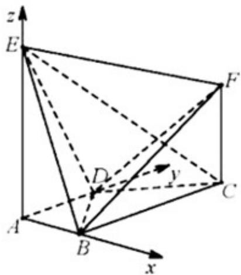

> [!faq]- 2019年高考理科数学试题(天津卷)及参考答案解析
>
> > [!success]- **【答案】** （Ⅰ）见证明；（Ⅱ） $\frac{4}{9}$ （Ⅲ） $\frac{8}{7}$
>
> > [!note]- **【分析】**
> > 首先利用几何体的特征建立空间直角坐标系
>
> > [!note]- **【解析】**
> > 依题意, 可以建立以 $A$ 为原点, 分别以 $AB, AD, AE$ 的方向为 $x$ 轴, $y$ 轴, $z$ 轴正方向的空间直角坐标系(如图),
> >
> > 
> >
> > 可得 $A(0,0,0)$ , $B(1,0,0)$ , $C(1,2,0)$ , $D(0,1,0)$ , $E(0,0,2)$ .
> >
> > 设 $CF = h(h > 0)$ ，则 $F(1,2,h)$
> >
> > (I)依题意， $AB=(1,0,0)$ 是平面ADE的法向量，
> >
> > 又 $BF=(0,2,h)$ ，可得 $BF\cdot AB=0$ ，
> >
> > 又因为直线 $BF \not\subset$ 平面 ADE，所以 $BF \parallel$ 平面 ADE.
> >
> > (Ⅱ)依题意， $BD=(-1,1,0)$ ， $BE=(-1,0,2)$ ， $CE=(-1,-2,2)$ ，
> >
> > 设 $n = (x,y,z)$ 为平面 $BDE$ 的法向量，
> >
> > 则 $\left\{ \begin{array}{l} n \cdot BD = 0 \\ n \cdot BE = 0 \end{array} \right.$ 即 $\left\{ \begin{array}{l} -x + y = 0 \\ -x + 2z = 0 \end{array} \right.$
> >
> > 不妨令 z=1，可得 $n=(2,2,1)$ ，
> >
> > 因此有 $\cos\langle CE,n\rangle=\frac{\rightarrow CE\cdot n}{|CE||n|}=-\frac{4}{9}$
> >
> > 所以，直线 $CE$ 与平面 $BDE$ 所成角的正弦值为 $\frac{4}{9}$
> >
> > (Ⅲ)设 $m = (x,y,z)$ 为平面 $BDF$ 的法向量，则 $\left\{ \begin{array}{l} m_{-}BD = 0 \\ m \cdot BF = 0 \end{array} \right.$ ，即 $\left\{ \begin{array}{l} -x + y = 0 \\ 2y + hz = 0 \end{array} \right.$ .
> >
> > 不妨令 y=1，可得 $m=\left(1,1,-\frac{2}{h}\right)$ .
> >
> > 由题意，有 $\left|\cos\left\langle m,n\right\rangle\right|=\frac{\left|\vec{m}\cdot n\right|}{\left|m\right|\times\left|n\right|}=\frac{\left|4-\frac{2}{h}\right|}{3\sqrt{2+\frac{4}{h^{2}}}}=\frac{1}{3}$ ，解得 $h=\frac{8}{7}$ .
> >
> > 经检验，符合题意。
> >
> > $$
> > \begin{array}{c} \frac {8}{7} \end{array}
> > $$
> >
> > 所以，线段 $CF$ 的长为 $\overline{7}$ 。
> >
> > 【点睛】本题主要考查直线与平面平行、二面角、直线与平面所成的角等基础知识.考查用空间向量解决立体几何问题的方法.考查空间想象能力、运算求解能力和推理论证能力.
