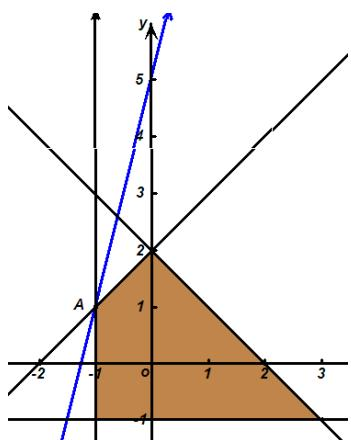

> [!faq]- 2019年高考理科数学试题(天津卷)及参考答案解析
>
> > [!success]- **【答案】** C 【
>
> > [!note]- **【分析】**
> > 画出可行域，用截距模型求最值。
>
> > [!note]- **【解析】**
> > 已知不等式组表示的平面区域如图中的阴影部分。
> >
> > 目标函数的几何意义是直线 $y = 4x + z$ 在 $y$ 轴上的截距，
> >
> > 故目标函数在点 A 处取得最大值。
> >
> > 由 $\left\{\begin{aligned}x-y+2&=0,\\ x&=-1\end{aligned}\right.$ ，得 $A(-1,1)$ ，
> >
> > 所以 $z_{\max} = -4 \times (-1) + 1 = 5$ 。
> >
> > 故选 C。
> >
> > 
> >
> > 【点睛】线性规划问题，首先明确可行域对应的是封闭区域还是开放区域，分界线是实线还是虚线，其次确定目标函数的几何意义，是求直线的截距、两点间距离的平方、直线的斜率、还是点到直线的距离等等，最后结合图形确定目标函数最值或范围．即：一画，二移，三求.
