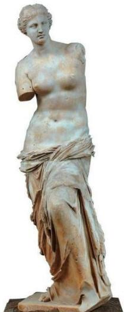

<!-- question-source:start -->
4.古希腊时期，人们认为最美人体的头顶至肚脐的长度与肚脐至足底的长度之比是 $\frac{\sqrt{5} - 1}{2}$ （ $\frac{\sqrt{5} - 1}{2} \approx 0.618$ 称为黄金分割比例），著名的“断臂维纳斯”便是如此。此外，最美人体的头顶至咽喉的长度与咽喉至肚脐的长度之比也是 $\frac{\sqrt{5} - 1}{2}$ 。若某人满足上述两个黄金分割比例，且腿长为 $105\mathrm{cm}$ ，头顶至脖子下端的长度为 $26\mathrm{cm}$ ，则其身高可能是（）

A. $165 \mathrm{~cm}$ B. $175 \mathrm{~cm}$ C. $185 \mathrm{~cm}$

D.190cm
<!-- question-source:end -->

![[高中/真题/按年份分类/2019/2019年高考真题数学_文__山东卷__含解析版_/一/题目/answers/Q00023510A1.md]]
