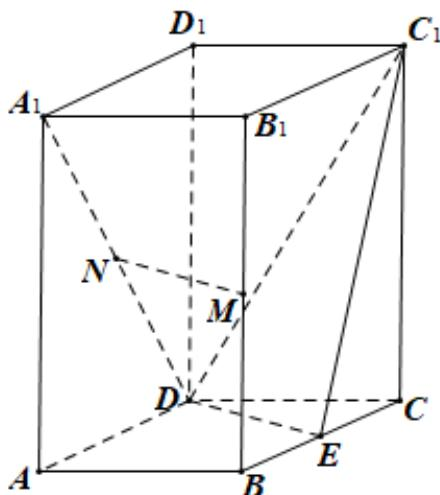

<!-- question-source:start -->
19.如图直四棱柱 $ABCD - A_{1}B_{1}C_{1}D_{1}$ 的底面是菱形， $AA_{1} = 4, AB = 2$ ， $\angle BAD = 60^{\circ}$

$E, M, N$ 分别是 $BC, BB_{1}, A_{1}D$ 的中点.

(1) 证明: $MN //$ 平面 $C_{1}DE$

(2) 求点 $C$ 到平面 $C_{1}DE$ 的距离.

<!-- question-source:end -->

![[高中/真题/按年份分类/2019/2019年高考真题数学_文__山东卷__含解析版_/一/题目/answers/Q00023525A1.md]]
