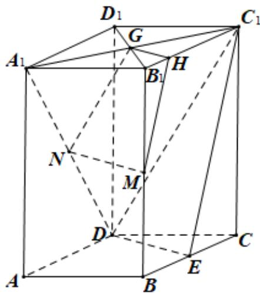

> [!faq]- 2019年高考真题数学【文】(山东卷)（含解析版）解析
>
> > [!success]- **【答案】** 见解析
>
> > [!note]- **【分析】**
> > 本题未单列分析。
>
> > [!note]- **【解析】**
> > (1) 连结 $A_{1}C_{1}, B_{1}D_{1}$ 相交于点 G，再过点 M 作 $MH // C_{1}E$ 交 $B_{1}C_{1}$ 于点 H，再连结 GH，NG.
> > ∵ E, M, N 分别是 BC, BB₁, A₁D 的中点.
> >
> > 于是可得到 $NG // C_{1}D$ ，GH // DE，
> >
> > 于是得到平面 $NGHM //$ 平面 $C_1DE$ ，
> >
> > 由∵MN ⊂ 平面 NGHM，于是得到 MN // 平面 $C_{1}DE$
> >
> > 
> > (2) $\because E$ 为 $BC$ 中点， $ABCD$ 为菱形且 $\angle BAD = 60^{\circ}$
> >
> > $\therefore DE \perp BC$ ，又 $\because ABCD - A_{1}B_{1}C_{1}D_{1}$ 为直四棱柱， $\therefore DE \perp CC_{1}$
> >
> > $$
> > \therefore D E \perp C _ {1} E, \text {又} ^ {\because A B = 2, A A _ {1} = 4},
> > $$
> >
> > $\therefore DE = \sqrt{3}, C_1E = \sqrt{17}$ ，设点 $C$ 到平面 $C_1DE$ 的距离为 $h$
> >
> > 由 $V_{C - C_1DE} = V_{C_1 - DCE}$ 得
> >
> > $$
> > \frac {1}{3} \times \frac {1}{2} \times \sqrt {3} \times \sqrt {1 7} \times h = \frac {1}{3} \times \frac {1}{2} \times 1 \times \sqrt {3} \times 4
> > $$
> >
> > 解得 $h = \frac{4}{17}\sqrt{17}$
> >
> > 所以点 $C$ 到平面 $C_1DE$ 的距离为 $\frac{4}{17}\sqrt{17}$
