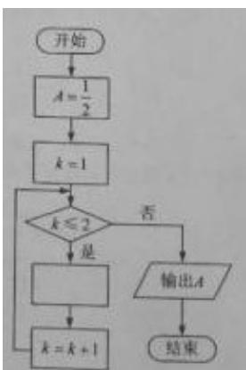

<!-- question-source:start -->
9. 右图是求 $\frac{1}{2 + \frac{1}{2 + \frac{1}{2}}}$ 的程序框图，图中空白框中应填入（）

A. $A = \frac{1}{2 + A}$

B. $A=2+\frac{1}{A}$

C. $A=1+\frac{1}{2A}$

D. $A=\frac{1}{1+2A}$
<!-- question-source:end -->

![[高中/真题/按年份分类/2019/2019年高考真题数学_文__山东卷__含解析版_/一_试卷全图/题目/answers/Q00023515A1.md]]
