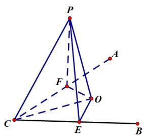

> [!faq]- 2019年高考真题数学【文】(山东卷)（含解析版）解析
>
> > [!success]- **【答案】** $$ \sqrt {2} $$
>
> > [!note]- **【分析】**
> > 本题未单列分析。
>
> > [!note]- **【解析】**
> > 答案:
> >
> > $$
> > \sqrt {2}
> > $$
> >
> > 解答：
> >
> > 如图，过 $P$ 点做平面 $ABC$ 的垂线段，垂足为 $O$ ，则 $PO$ 的长度即为所求，再做 $PE \perp CB, PF \perp CA$ ，由线面的垂直判定及性质定理可得出 $OE \perp CB, OF \perp CA$ ，在 $Rt\Delta PCF$ 中，由 $PC = 2, PF = \sqrt{3}$ ，可得出 $CF = 1$ ，同理在 $Rt\Delta PCE$ 中可得出 $CE = 1$ ，结合 $\angle ACB = 90^{\circ}$ ， $OE \perp CB, OF \perp CA$ 可得出 $OE = OF = 1$ ， $OC = \sqrt{2}$ ， $PO = \sqrt{PC^{2} - OC^{2}} = \sqrt{2}$
> >
> > 
