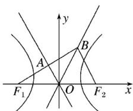

> [!faq]- 2019年高考真题数学【理】(山东卷)（含解析版）解析
>
> > [!success]- **【答案】** 2
>
> > [!note]- **【分析】**
> > 本题未单列分析。
>
> > [!note]- **【解析】**
> > 因为 $F1B \cdot F2B = 0$ ，所以 $F_{1}B \perp F_{2}B$ ，如图.
> >
> > 
> >
> > 因为 $\overrightarrow{F_1A} = \overrightarrow{AB}$ ，所以点 $A$ 为 $F_{1}B$ 的中点，又点 $O$ 为 $F_{1}F_{2}$ 的中点，所以 $OA\| BF_{2}$ ，所以 $F_{1}B \perp OA$ ，所以 $|OF_{1}| = |OB|$ ，所以 $\angle BF_{1}O = \angle F_{1}BO$ ，所以 $\angle BOF_{2} = 2\angle BF_{1}O.$ 因为直线 $OA$ ， $OB$ 为双曲线 $C$ 的两条渐近线，
> >
> > 所以 $\tan\angle BOF_{2}=\frac{b}{a}$ ， $\tan\angle BF_{1}O=\frac{a}{b}$ .
> >
> > 因为 $\tan\angle BOF_{2}=\tan(2\angle BF_{1}O)$ ,
> >
> > 所以 $\frac{\frac{b}{a}}{1-\left(\frac{a}{b}\right)^{2}}$ ，所以 $b^{2}=3a^{2}$ ，
> >
> > 所以 $c^{2}-a^{2}=3a^{2}$ ,
> >
> > 即 2a=c，所以双曲线的离心率 $e=\frac{c}{a}=2$ .
