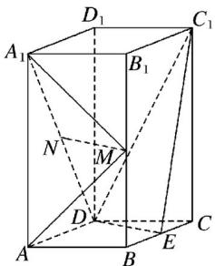
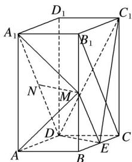
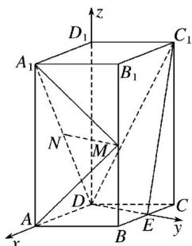

<!-- question-source:start -->
18．如图，直四棱柱 $ABCD-A_{1}B_{1}C_{1}D_{1}$ 的底面是菱形， $AA_{1}=4,\ AB=2,\ \angle BAD=60^{\circ}, E, M, N$ 分别是 BC, $BB_{1}, A_{1}D$ 的中点.

(1)证明： $MN\|$ 平面 $C_1DE$

(2)求二面角 $A - MA_{1} - N$ 的正弦值.

(1)证明 连接 $B_{1}C$ ， $ME$ .因为 $M$ ， $E$ 分别为 $BB_{1}$ ， $BC$ 的中点，所以 $ME \parallel B_{1}C$ ，且 $ME = \frac{1}{2} B_{1}C$ .

又因为 $N$ 为 $A_{1}D$ 的中点，所以 $ND = \frac{1}{2} A_{1}D$ .

由题设知 $A_{1}B_{1} \parallel DC$ 且 $A_{1}B_{1} = DC$ ，可得 $B_{1}C \parallel A_{1}D$ 且 $B_{1}C = A_{1}D$ ，故 $ME \parallel ND$ 且 $ME = ND$ ，因此四边形 $MNDE$ 为平行四边形， $MN \parallel ED$ .又 $MN \notin$ 平面 $C_{1}DE$ ， $ED \subset$ 平面 $C_{1}DE$ ，所以 $MN \parallel$ 平面 $C_{1}DE$ .

(2)解 由已知可得 $DE \perp DA$ ，以 $D$ 为坐标原点， $DA$ 的方向为 $x$ 轴正方向，建立如图所示的空间直角坐标系 $D - xyz$ ，

则 $A(2,0,0)$ ， $A_{1}(2,0,4)$ ， $M(1,\sqrt{3},2)$ ， $N(1,0,2)$ ， $\overrightarrow{A_1A} = (0,0,-4)$ ， $\overrightarrow{A_1M} = (-1,\sqrt{3},-2)$ ， $\overrightarrow{A_1N} = (-1,0,-2)$ ， $\overrightarrow{MN} = (0,-\sqrt{3},0)$ .

设 $m=(x, y, z)$ 为平面 $A_{1}MA$ 的一个法向量，则

$$
\left\{ \begin{array}{l} \boldsymbol {m} \cdot \overrightarrow {A _ {1} M} = 0, \\ \boldsymbol {m} \cdot \overrightarrow {A _ {1} A} = 0, \end{array} \right.
$$

所以 $\left\{\begin{aligned}-x+\sqrt{3}y-2z&=0,\\ -4z&=0,\end{aligned}\right.$ 可得 $m=(\sqrt{3},1,0)$ .

设 $n = (p, q, r)$ 为平面 $A_{1}MN$ 的一个法向量，则

$$
\left\{ \begin{array}{l} \boldsymbol {n} \cdot \overrightarrow {M N} = 0, \\ \boldsymbol {n} \cdot \overrightarrow {A _ {1} N} = 0, \end{array} \right.
$$

所以 $\left\{\begin{aligned}-\sqrt{3}q&=0,\\ -p-2r&=0,\end{aligned}\right.$ 可取 $n=(2,0,-1)$ .

于是 $\cos \langle m, n \rangle = \frac{m \cdot n}{|m||n|} = \frac{2\sqrt{3}}{2 \times \sqrt{5}} = \frac{\sqrt{15}}{5}$ ,

所以二面角 $A - MA_{1} - N$ 的正弦值为 5 .
<!-- question-source:end -->

![[高中/真题/按年份分类/2019/2019年高考真题数学_理__山东卷__含解析版_/解答题/题目/answers/Q00022109A1.md]]
