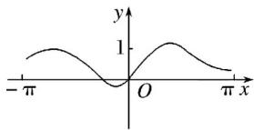
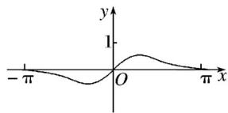
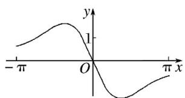
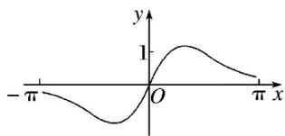

<!-- question-source:start -->
5. 函数 $f(x) = \frac{\sin x + x}{\cos x + x^2}$ 在 $[- \pi, \pi]$ 上的图象大致为（）

A.

B.  

C.

D.
<!-- question-source:end -->

![[高中/真题/按年份分类/2019/2019年高考真题数学_理__山东卷__含解析版_/选择题/题目/answers/Q00022096A1.md]]
