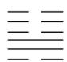

<!-- question-source:start -->
6.我国古代典籍《周易》用“卦”描述万物的变化，每一“重卦”由从下到上排列的6个爻组成，爻分为阳爻“\_\_\_\_”和阴爻“——”，如图就是一重卦，在所有重卦中随机取一重卦，则该重卦恰有3个阳爻的概率是( )

$\frac{5}{16}$ $\frac{11}{32}$ $\frac{21}{32}$ $\frac{11}{16}$ A. B. C. D.
<!-- question-source:end -->

![[高中/真题/按年份分类/2019/2019年高考真题数学_理__山东卷__含解析版_/选择题/题目/answers/Q00022097A1.md]]
