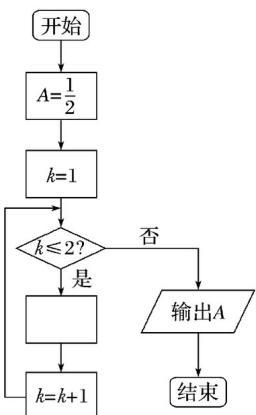

<!-- question-source:start -->
9. 

A. $A = \frac{1}{2 + A}$ B. $A = 2 + \frac{1}{A}$ C. $A = \frac{1}{1 + 2A}$ D. $A = 1 + \frac{1}{2A}$
<!-- question-source:end -->

![[高中/真题/按年份分类/2019/2019年高考真题数学_理__山东卷__含解析版_/选择题/题目/answers/Q00022100A1.md]]
