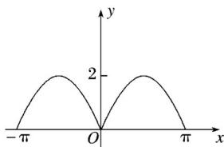

> [!faq]- 2019年高考真题数学【理】(山东卷)（含解析版）解析
>
> > [!success]- **【答案】** C
>
> > [!note]- **【分析】**
> > 本题未单列分析。
>
> > [!note]- **【解析】**
> > $f(-x) = \sin | - x| + |\sin (-x)| = \sin |x| + |\sin x| = f(x)$ ， $\therefore f(x)$ 为偶函数，故①正确；当 $< x < \pi$ 时，
> >
> > 
> >
> > $f(x)=\sin x+\sin x=2\sin x,\therefore f(x)$ 在 $\left(\frac{\pi}{2},\pi\right)$ 上单调递减，故②不正确； $f(x)$ 在 $[-π,π]$ 上的图象如图所示，由图可知函数 $f(x)$ 在 $[-π,π]$ 上只有3个零点，故③不正确； $\because y=\sin|x|$ 与 $y=|\sin x|$ 的最大值都为1且可以同时取到， $\therefore f(x)$ 可以取到最大值2，故④正确．综上，正确结论的编号是①④.故选C.
