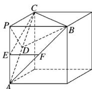

> [!faq]- 2019年高考真题数学【理】(山东卷)（含解析版）解析
>
> > [!success]- **【答案】** D
>
> > [!note]- **【分析】**
> > 本题未单列分析。
>
> > [!note]- **【解析】**
> > 因为点 $E$ ， $F$ 分别为 $PA$ ， $AB$ 的中点，所以 $EF \parallel PB$ ，因为 $\angle CEF = 90^\circ$ ，所以 $EF \perp CE$ ，所以 $PB \perp CE$ .
> >
> > 取 $AC$ 的中点 $D$ , 连接 $BD$ , $PD$ , 易证 $AC \perp$ 平面 $BDP$ ,
> >
> > 所以 $PB \perp AC$ ，又 $AC \cap CE = C$ ， $AC$ ， $CE \subset$ 平面 $PAC$ ，所以 $PB \perp$ 平面 $PAC$ ，所以 $PB \perp PA$ ， $PB \perp PC$ ，因为 $PA = PB = PC$ ， $\triangle ABC$ 为正三角形，所以 $PA \perp PC$ ，即 $PA$ ， $PB$ ， $PC$ 两两垂直，将三棱锥 $P - ABC$ 放在正方体中如图所示。因为 $AB = 2$ ，所以该正方体的棱长为 $\sqrt{2}$ ，所以该正方体的体对角线长为 $\sqrt{6}$ ，所以三棱锥 $P - ABC$ 的外接球的半径 $R = \frac{\sqrt{6}}{2}$ ，所以球 $O$ 的体积 $V = \frac{4}{3} \pi R^3 = \frac{4}{3} \pi \left( \frac{\sqrt{6}}{2} \right)^3 = \sqrt{6} \pi$ ，故选 D.
> >
> > 
