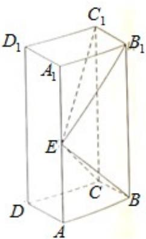

<!-- question-source:start -->
17. (12 分)

如图，长方体 $ABCD-A_{1}B_{1}C_{1}D_{1}$ 的底面 ABCD 是正方形，点 E 在棱 $AA_{1}$ 上， $BE \perp EC_{1}$ .

<!-- question-source:end -->

![[高中/真题/按年份分类/2019/2019年高考重庆理科数学试题及答案_精校版_/解答题/题目/answers/Q00029033A1.md]]
