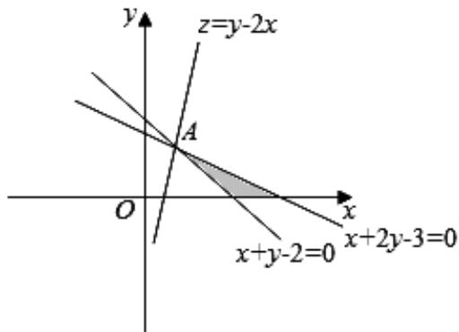

> [!faq]- 2020年上海高考数学真题试卷（word解析版）解析
>
> > [!success]- **【答案】** -1。
>
> > [!note]- **【分析】**
> > 本题未单列分析。
>
> > [!note]- **【解析】**
> > 由约束条件 $\left\{\begin{aligned}x+y-2...0\\ x+2y-3,0\\ y...0\end{aligned}\right.$ 作出可行域如图阴影部分，
> >
> > 
> >
> > 化目标函数 $z = y - 2x$ 为 $y = 2x + z$ ，由图可知，当直线 $y = 2x + z$ 过 $A$ 时，直线在 $y$ 轴上的
> >
> > 截距最大，联立 $\left\{\begin{aligned}x+y-2&=0\\ x+2y-3&=0\end{aligned}\right.$ ，解得 $\left\{\begin{aligned}x&=1\\ y&=1\end{aligned}\right.$ ，即 $A(1,1)$ .
> >
> > z 有最大值为 $1 - 2 \times 1 = -1$ 。故答案为：-1。
