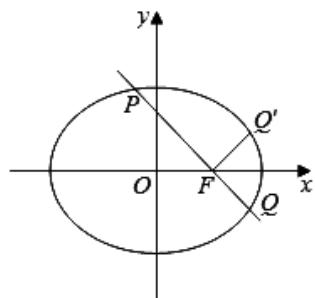

> [!faq]- 2020年上海高考数学真题试卷（word解析版）解析
>
> > [!success]- **【答案】** $x + y - 1 = 0$
>
> > [!note]- **【分析】**
> > 本题未单列分析。
>
> > [!note]- **【解析】**
> > 椭圆 $C:\frac{x^{2}}{4}+\frac{y^{2}}{3}=1$ 的右焦点为 $F(1,0)$ ,
> >
> > 直线 $l$ 经过椭圆右焦点 $F$ ，交椭圆 $C$ 于 $P$ 、 $Q$ 两点（点 $P$ 在第二象限），
> >
> > 若点 $Q$ 关于 $x$ 轴对称点为 $Q'$ ，且满足 $PQ \perp FQ'$ ，
> >
> > 可知直线 l 的斜率为 -1，所以直线 l 的方程是： $y = -(x - 1)$ ，
> >
> > $$
> > x + y - 1 = 0
> > $$
> >
> > 故答案为： $x + y - 1 = 0$
> >
> > 
