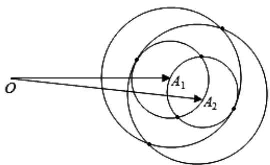

> [!faq]- 2020年上海高考数学真题试卷（word解析版）解析
>
> > [!success]- **【答案】** 为：6.
>
> > [!note]- **【分析】**
> > 本题未单列分析。
>
> > [!note]- **【解析】**
> > 如图，设 $OA_{1}=a_{1}$ ， $OA_{2}=a_{2}$ ，
> >
> > 
> >
> > 由 $\left|a_{1}-a_{2}\right|=1$ ，且 $\left|a_{i}-b_{j}\right|\in\{1,2\}$ ，分别以 $A_{1},A_{2}$ 为圆心，以1和2为半径画圆，其中任
> >
> > 意两圆的公共点共有6个．故满足条件的 $k$ 的最大值为6．故
