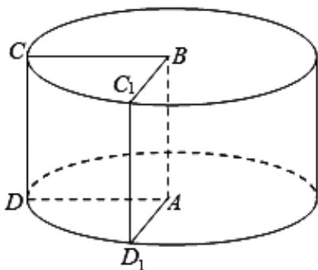

<!-- question-source:start -->
17. （14分）已知 $ABCD$ 是边长为1的正方形，正方形 $ABCD$ 绕 $AB$ 旋转形成一个圆柱.

(1) 求该圆柱的表面积;

(2) 正方形 $ABCD$ 绕 $AB$ 逆时针旋转 $\frac{\pi}{2}$ 至 $ABC_{1}D_{1}$ ，求线段 $CD_{1}$ 与平面 $ABCD$ 所成的角.

<!-- question-source:end -->

![[高中/真题/按年份分类/2020/2020年上海高考数学真题试卷_word解析版_/解答题/题目/answers/Q00024003A1.md]]
