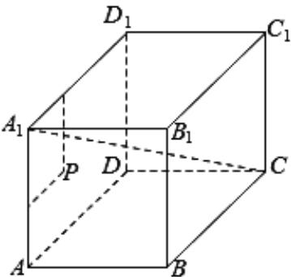

<!-- question-source:start -->
15. 在棱长为 10 的正方体 $ABCD - A_{1}B_{1}C_{1}D_{1}$ 中， $P$ 为左侧面 $ADD_{1}A_{1}$ 上一点，已知点 $P$ 到 $A_{1}D_{1}$ 的距离为 3， $P$ 到 $AA_{1}$ 的距离为 2，则过点 $P$ 且与 $A_{1}C$ 平行的直线相交的面是（）

A. $AA_{1}B_{1}B$ B. $BB_{1}C_{1}C$ C. $CC_{1}D_{1}D$ D. $ABCD$
<!-- question-source:end -->

![[高中/真题/按年份分类/2020/2020年上海高考数学真题试卷_word解析版_/选择题/题目/answers/Q00024001A1.md]]
