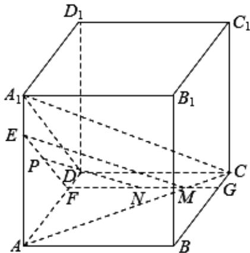

> [!faq]- 2020年上海高考数学真题试卷（word解析版）解析
>
> > [!success]- **【答案】** D
>
> > [!note]- **【分析】**
> > 本题未单列分析。
>
> > [!note]- **【解析】**
> > 如图，
> >
> > 
> >
> > 由点 P 到 $A_{1}D_{1}$ 的距离为 3，P 到 $AA_{1}$ 的距离为 2，
> >
> > 可得 $P$ 在 $\triangle AA_{1}D$ 内，过 $P$ 作 $EF / / A_{1}D$ ，且 $EF\cap AA_{1}$ 于 $E$ ， $EF\cap AD$ 于 $F$
> >
> > 在平面 $ABCD$ 中，过 $F$ 作 $FG // CD$ ，交 $BC$ 于 $G$ ，则平面 $EFG // \text{平面} A_{1}DC$ ：
> >
> > 连接 AC，交 FG 于 M，连接 EM，∵ 平面 EFG // 平面 $A_{1}DC$ ，平面 $A_{1}AC \cap$ 平面
> >
> > $A_{1}DC = A_{1}C$ ，平面 $A_{1}AC \cap$ 平面 EFM = EM，∴ EM // A1C.
> >
> > 在 $\Delta EFM$ 中，过 $P$ 作 $PN // EM$ ，且 $PN \cap FM$ 于 $N$ ，则 $PN // A_{1}C$ ：
> >
> > ∵ 线段 FM 在四边形 ABCD 内，N 在线段 FM 上，∴ N 在四边形 ABCD 内.
> >
> > ∴过点 P 且与 $A_{1}C$ 平行的直线相交的面是 ABCD．故选：D．
