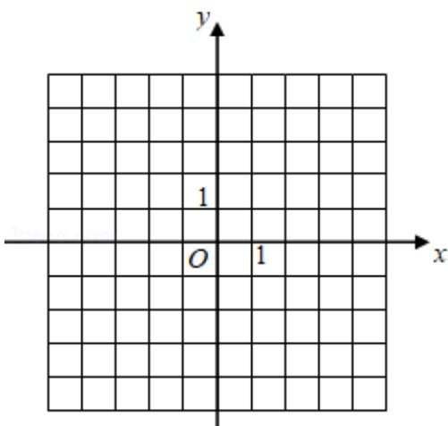

<!-- question-source:start -->
23. 已知函数 $f(x) = |3x + 1| - 2|x - 1|$ .

(1) 画出 $y = f(x)$ 的图象；

(2) 求不等式 $f(x) > f(x+1)$ 的解集.

# 2020 年全国统一高考数学试卷（文科）（新课标 I）

参考答案与试题解析

##
一、选择题：本题共12小题，每小题5分，共60分。在每小题给出的四个选项中，只有一项是符合题目要求的。
<!-- question-source:end -->

![[高中/真题/按年份分类/2020/2020年全国统一高考数学试卷_文科__新课标ⅰ__含解析版_/填空题/题目/answers/Q00030830A1.md]]
