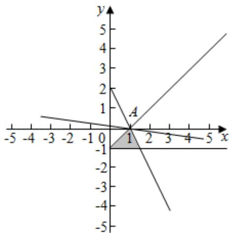

> [!faq]- 2020年全国统一高考数学试卷（文科）（新课标ⅰ）（含解析版）解析
>
> > [!success]- **【答案】** 1
>
> > [!note]- **【分析】**
> > 先根据约束条件画出可行域，再利用几何意义求最值，只需求出可行域直线在 $y$ 轴上的截距最大值即可.
>
> > [!note]- **【解析】**
> > 解： $x, y$ 满足约束条件 $\left\{ \begin{array}{l} 2x + y - 2 \leqslant 0, \\ x - y - 1 \geqslant 0, \\ y + 1 \geqslant 0, \end{array} \right.$ ，不等式组表示的平面区域如图所示，
> >
> > 由 $\left\{ \begin{array}{l} 2x + y - 2 = 0 \\ x - y - 1 = 0 \end{array} \right.$ ，可得 $A(1, 0)$ 时，目标函数 $z = x + 7y$ ，可得 $y = -\frac{1}{7}x + \frac{1}{7}z$ ，当直线 $y = -\frac{1}{7}x + \frac{1}{7}z$ 过点 $A$ 时，在 $y$ 轴上截距最大，
> >
> > 此时 $z$ 取得最大值： $1 + 7 \times 0 = 1$ .
> >
> > 故答案为：1.
> >
> > 故答案为：1.
> >
> > 
