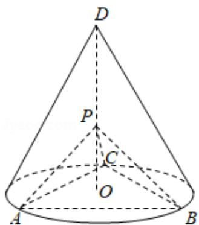

<!-- question-source:start -->
19. (12 分) 如图, $D$ 为圆锥的顶点, $O$ 是圆锥底面的圆心, $\triangle ABC$ 是底面的内接正三角形, $P$ 为 $DO$ 上一点, $\angle APC = 90^{\circ}$ .

(1) 证明: 平面 $PAB \perp$ 平面 $PAC$ ;

(2) 设 $DO = \sqrt{2}$ ，圆锥的侧面积为 $\sqrt{3}\pi$ ，求三棱锥 P - ABC 的体积.

<!-- question-source:end -->

![[高中/真题/按年份分类/2020/2020年全国统一高考数学试卷_文科__新课标ⅰ__含解析版_/解答题/题目/answers/Q00024861A1.md]]
