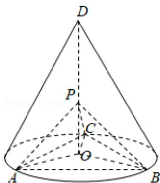

> [!faq]- 2020年全国统一高考数学试卷（文科）（新课标ⅰ）（含解析版）解析
>
> > [!success]- **【答案】** 详见解析
>
> > [!note]- **【分析】**
> > (1) 首先利用三角形的全等的应用求出 $AP \perp BP, CP \perp BP$ , 进一步求出二面角的平面角为直角, 进一步求出结论.
> > (2) 利用锥体的体积公式和圆锥的侧面积公式的应用及勾股定理的应用求出结果.
>
> > [!note]- **【解析】**
> > 解：
> > （1）连接 $OA$ ， $OB$ ， $OC$ ， $\triangle ABC$ 是底面的内接正三角形，
> >
> > 所以 AB=BC=AC.
> >
> > O 是圆锥底面的圆心，所以：OA=OB=OC，
> >
> > 所以 $AP = BP = CP = OA^{2} + OP^{2} = OB^{2} + OP^{2} = OC^{2} + OP^{2}$
> >
> > 所以 $\triangle APB\cong\triangle BPC\cong\triangle APC,$
> >
> > 由于 $\angle APC = 90^{\circ}$
> >
> > 所以 $\angle APB = \angle BPC = 90^{\circ}$
> >
> > 所以 $AP \perp BP$ ， $CP \perp BP$
> >
> > 由于 $AP \cap CP = P$ ,
> >
> > 所以 $BP \perp$ 平面 $APC$ ,
> >
> > 由于 $BP \subset$ 平面 $PAB$ ,
> >
> > 所以：平面 $PAB \perp$ 平面 $PAC$ .
> > (2) 设圆锥的底面半径为 $r$ ，圆锥的母线长为 $l$ ，
> >
> > 所以 $1 = \sqrt{2 + r^2}$
> >
> > 由于圆锥的侧面积为 $\sqrt{3}\pi$
> >
> > 所以 $\pi \cdot r \cdot \sqrt{2 + r^2} = \sqrt{3}\pi$ ，整理得 $(r^2 + 3) (r^2 - 1) = 0$
> >
> > 解得 r=1.
> >
> > 所以 $AB = \sqrt{1 + 1 - 2 \times 1 \times 1 \times \left(-\frac{1}{2}\right)} = \sqrt{3}$ .
> >
> > 由于 $AP^2 + BP^2 = AB^2$ ，解得 $AP = \sqrt{\frac{3}{2}}$
> >
> > 则： $V_{P-ABC}=\frac{1}{3}\times\frac{1}{2}\times\sqrt{\frac{3}{2}}\times\sqrt{\frac{3}{2}}\times\sqrt{\frac{3}{2}}=\frac{\sqrt{6}}{8}.$
> >
> > 
> >
> > 【点评】本题考查的知识要点: 面面垂直的判定和性质的应用, 几何体的体积公式的应用, 主要考查学生的运算能力和转换能力及思维能力, 属于中档题型.
