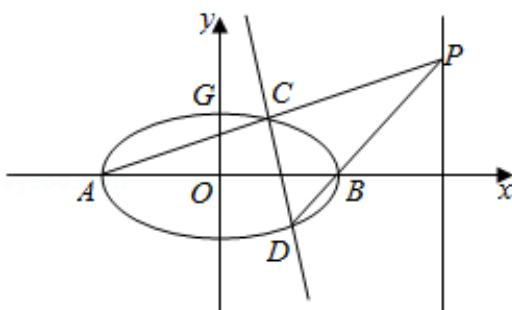

> [!faq]- 2020年全国统一高考数学试卷（文科）（新课标ⅰ）（含解析版）解析
>
> > [!success]- **【答案】** 详见解析
>
> > [!note]- **【分析】**
> > （1）根据椭圆的几何性质，可写出 A、B 和 G 的坐标，再结合平面向量的坐标运算列出关于 a 的方程，解之即可；
> > (2) 设 $C(x_{1}, y_{1})$ , $D(x_{2}, y_{2})$ , $P(6, t)$ ，然后分两类讨论：① t=0，设直线 CD 的方程为 x=$my + n$ ，写出直线 $PA$ 和 $PB$ 的方程后，消去 $t$ 可得 $3y_{1}(x_{2} - 3) = y_{2}(x_{1} + 3)$ ，结合 $\frac{x_2^2}{9} +y_2^2 = 1,$ 消去 $x_{2} - 3$ ，可得 $(27 + m^2)y_1y_2 + m(n + 3)(y_1 + y_2) + (n + 3)^2 = 0$ ，然后联立直线 $CD$ 和椭圆的方程，消去 $x$ ，写出韦达定理，并将其代入上式化简整理得关于 $m$ 和 $n$ 的恒等式，可解得 $n = \frac{3}{2}$ 或-3（舍），从而得直线 $CD$ 过定点 $(\frac{3}{2},0)$ ；②若 $t = 0$ ，则直线 $CD$ 的方程为 $y$ $= 0$ ，只需验证直线 $CD$ 是否经过点 $(\frac{3}{2},0)$ 即可.
>
> > [!note]- **【解析】**
> > 解：
> > (1)由题设得， $A(-a,0),B(a,0),G(0,1)$ ，则 $\overrightarrow{AG} = (a,1),\overrightarrow{GB} = (a, - 1)$ 由 $\overrightarrow{AG}\cdot \overrightarrow{GB} = 8$ 得 $a^2 -1 = 8$ ，即 $a = 3$ 所以 $E$ 的方程为 $\frac{x^2}{9} +y^2 = 1.$
> > (2) 设 $C(x_{1}, y_{1})$ , $D(x_{2}, y_{2})$ , $P(6, t)$ ,
> >
> > 若 t=0，设直线 CD 的方程为 $x=my+n$ ，由题可知，-3<n<3，
> >
> > 由于直线 $PA$ 的方程为 $y = \frac{t}{9} (x + 3)$ ，所以 $y_{1} = \frac{t}{9} (x_{1} + 3)$ ，同理可得 $y_{2} = \frac{t}{3} (x_{2} - 3)$ ，于是有 $3y_{1}(x_{2} - 3) = y_{2}(x_{1} + 3)$ ①.
> >
> > 由于 $\frac{x_2^2}{9} + y_2^2 = 1$ ，所以 $y_2^2 = -\frac{(x_2 + 3)(x_2 - 3)}{9}$ ，
> >
> > $$
> > x _ {2} - 3
> > $$
> >
> > $$
> > 2 7 y _ {1} y _ {2} = - \left(x _ {1} + 3\right) \quad \left(x _ {2} + 3\right)
> > $$
> >
> > $$
> > (2 7 + \mathrm{m} ^ {2}) \mathrm{y} _ {1} \mathrm{y} _ {2} + \mathrm{m} (\mathrm{n} + 3) \left(\mathrm{y} _ {1} + \mathrm{y} _ {2}\right) + (\mathrm{n} + 3) ^ {2} = 0 (2),
> > $$
> >
> > 联立 $\left\{ \begin{array}{l} x = my + n \\ \frac{x^2}{9} + y^2 = 1 \end{array} \right.$ 得， $(m^2 + 9)y^2 + 2mny + n^2 - 9 = 0,$
> >
> > 所以 $\mathrm{y}_1 + \mathrm{y}_2 = -\frac{2mn}{m^2 + 9},\mathrm{y}_1\mathrm{y}_2 = \frac{n^2 - 9}{m^2 + 9},$ 代入②式得 $(27 + m^2)$ （ $n^2 - 9$ ） $-2m$ （ $n + 3$ ） $mn + (n + 3)^2$ （ $m^2 + 9$ ） $= 0$ ，解得 $n = \frac{3}{2}$ 或 $-3$ （因为 $-3 < n < 3$ ，所以舍 $-3$ ），故直线 $CD$ 的方程为 $x = my + \frac{3}{2}$ ，即直线 $CD$ 过定点 $(\frac{3}{2}, 0)$ 。若 $t = 0$ ，则直线 $CD$ 的方程为 $y = 0$ ，也过点 $(\frac{3}{2}, 0)$ 。综上所述，直线 $CD$ 过定点 $(\frac{3}{2}, 0)$ 。
> >
> > 
> >
> > 【点评】本题考查椭圆方程的求法、直线与椭圆的位置关系中的定点问题，涉及分类讨论的思想，有一定的计算量，考查学生的逻辑推理能力和运算能力，属于难题.
> >
> > ## (二) 选考题: 共 10 分。请考生在第 22、23 题中任选一题作答。如果多做, 则按所做的第一题计分。[选修 4-4: 坐标系与参数方程] (10 分)
