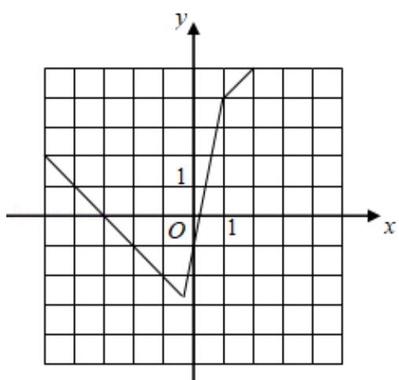
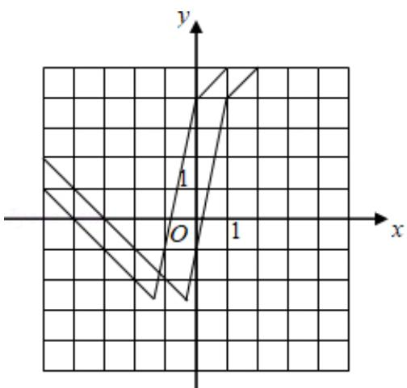

> [!faq]- 2020年全国统一高考数学试卷（文科）（新课标ⅰ）（含解析版）解析
>
> > [!success]- **【答案】** ； 【
>
> > [!note]- **【分析】**
> > （1）将函数零点分段，即可作出图象；
>
> > [!note]- **【解析】**
> > 分析】（1）将函数零点分段，即可作出图象；
> >
> > (2) 由于 $f(x + 1)$ 是函数 $f(x)$ 向左平移了一个1单位，作出图象可得
> > 答案；
> >
> > 【
> > 解答】解：函数 $f(x) = |3x + 1| - 2|x - 1| = \begin{cases} x + 3, & (x \geqslant 1) \\ 5x - 1, & (-\frac{1}{3} \leqslant x < 1) \\ -x - 3, & (x < -\frac{1}{3}) \end{cases}$ ，
> >
> > 图象如图所示
> >
> > 
> >
> > (2) 由于 $f(x + 1)$ 的图象是函数 $f(x)$ 的图象向左平移了一个1单位所得，（如图所示）
> >
> > 
> >
> > 直线 y=5x-1 向左平移一个单位后表示为 $y=5(x+1)-1=5x+4$ ,
> >
> > 联立 $\left\{\begin{aligned}y&=-x-3\\ y&=5x+4\end{aligned}\right.$ ，解得横坐标为 $x=-\frac{7}{6}$
> >
> > ∴不等式 $f(x) > f(x+1)$ 的解集为 $\{x|x < -\frac{7}{6}\}$ .
> >
> > 【点评】本题考查了绝对值函数的解法，分段作出图象是解题的关键．属于基础题.
