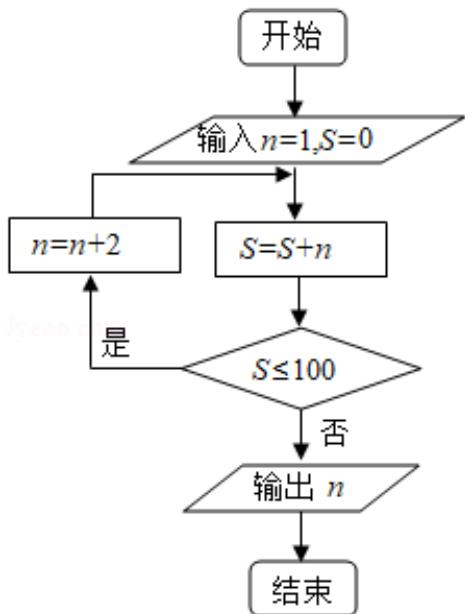

<!-- question-source:start -->
9. （5 分）执行如图的程序框图，则输出的 $n =$ （ ）

A. 17 B. 19 C. 21 D. 23
<!-- question-source:end -->

![[高中/真题/按年份分类/2020/2020年全国统一高考数学试卷_文科__新课标ⅰ__含解析版_/选择题/题目/answers/Q00024851A1.md]]
