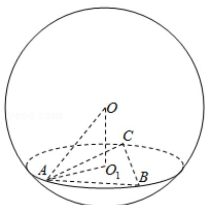

> [!faq]- 2020年全国统一高考数学试卷（文科）（新课标ⅰ）（含解析版）解析
>
> > [!success]- **【答案】** A
>
> > [!note]- **【分析】**
> > 画出图形，利用已知条件求出 $OO_{1}$ ，然后求解球的半径，即可求解球的表面积.
> > 【
>
> > [!note]- **【解析】**
> > 分析】画出图形，利用已知条件求出 $OO_{1}$ ，然后求解球的半径，即可求解球的表面积.
> > 【
> > 解答】解：由题意可知图形如图： $\odot O_{1}$ 的面积为 $4\pi$ ，可得 $O_{1}A=2$ ，则 $\frac{3}{2}AO_{1}=AB\sin60^{\circ},\quad\frac{3}{2}AO_{1}=\frac{\sqrt{3}}{2}AB,$ $\therefore AB=BC=AC=OO_{1}=2\sqrt{3},$ 外接球的半径为： $R=\sqrt{AO_{1}^{2}+OO_{1}^{2}}=4,$
> >
> > 球 O 的表面积： $4 \times \pi \times 4^{2} = 64\pi$ .
> >
> > 故选：A.
> >
> > 
> >
> > 【点评】本题考查球的内接体问题，球的表面积的求法，求解球的半径是解题的关键.
> >
> > ##
> > 二、填空题：本题共4小题，每小题5分，共20分。
