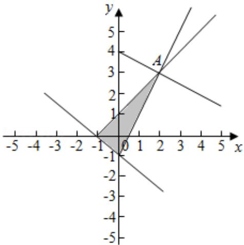

> [!faq]- 2020年全国统一高考数学试卷（文科）（新课标ⅱ）（含解析版）解析
>
> > [!success]- **【答案】** 8
>
> > [!note]- **【分析】**
> > 作出不等式组对应的平面区域，利用 $z$ 的几何意义，即可得到结论.
>
> > [!note]- **【解析】**
> > 解：作出不等式组对应的平面区域如图：
> >
> > 由 $z = x + 2y$ 得 $y = -\frac{1}{2} x + \frac{1}{2} z,$
> >
> > 平移直线 $y = -\frac{1}{2} x + \frac{1}{2} z$ 由图象可知当直线 $y = -\frac{1}{2} x + \frac{1}{2} z$ 经过点 $A$ 时，直线 $y = -\frac{1}{2} x + \frac{1}{2} z$ 的截距最大，
> >
> > 此时 $z$ 最大，
> >
> > 由 $\left\{\begin{aligned}x-y&=-1\\ 2x-y&=1\end{aligned}\right.$ ，解得A（2，3），
> >
> > 此时 $z=2+2\times3=8$ ，
> >
> > 故答案为：8.
> >
> > 
