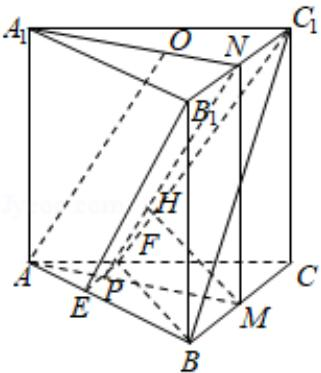

> [!faq]- 2020年全国统一高考数学试卷（文科）（新课标ⅱ）（含解析版）解析
>
> > [!success]- **【答案】** 详见解析
>
> > [!note]- **【分析】**
> > （1）先求出线线平行，可得线线垂直，即可求线面垂直，最后可得面面垂直；
>
> > [!note]- **【解析】**
> > 分析】（1）先求出线线平行，可得线线垂直，即可求线面垂直，最后可得面面垂直；
> >
> > (2) 利用体积转化法, 可得 $V_{B-EB_{1}C_{1}F}=V_{M-EB_{1}C_{1}F}=\frac{1}{3}S_{EB_{1}C_{1}F}\cdot MN$ , 再分别求 MN,
> >
> > $S_{EB_{1}C_{1}F}$ 即可求结论.
> >
> > 【
> > 解答】证明：（1）由题意知 $AA_{1}\|BB_{1}\|CC_{1}$ ,
> >
> > 又∵侧面 $BB_{1}C_{1}C$ 是矩形且 M，N 分别为 BC， $B_{1}C_{1}$ 的中点，
> >
> > $$
> > \therefore M N \| B B _ {1}, \quad B B _ {1} \bot B C,
> > $$
> >
> > $$
> > \therefore M N \| A A _ {1}, M N \perp B _ {1} C _ {1},
> > $$
> >
> > 又底面是正三角形，
> >
> > $$
> > \therefore A M \perp B C, A _ {1} N _ {1} \perp B _ {1} C _ {1},
> > $$
> >
> > 又∵MN∩AM=M,
> >
> > $\therefore B_{1}C_{1}\perp$ 平面 $A_{1}AMN,$
> >
> > $\because B_{1}C_{1}\subset$ 平面 $EB_{1}C_{1}F,$
> >
> > ∴平面 $A_{1}AMN \perp$ 平面 $EB_{1}C_{1}F$ ;
> >
> > 解：（2）∵AO∥平面 $EB_{1}C_{1}F$ ，AO⊂平面 $A_{1}AMN$ ，
> >
> > 平面 $A_{1}AMN \cap$ 平面 $EB_{1}C_{1}F = NP$ ,
> >
> > $\therefore AO\|NP,$
> >
> > $$
> > \because N O \| A P,
> > $$
> >
> > $$
> > \therefore A O = N P = 6, \quad O N = A P = \sqrt {3},
> > $$
> >
> > 过 M 作 $MH \perp NP$ ，垂足为 H，
> >
> > ∵平面 $A_{1}AMN \perp$ 平面 $EB_{1}C_{1}F$ ，平面 $A_{1}AMN \cap$ 平面 $EB_{1}C_{1}F = NP$ ，MH ⊂ 平面 $A_{1}AMN$ ，
> > ∴MH⊥平面 EB₁C₁F，
> >
> > $$
> > \because \angle M P N = \frac {\pi}{3},
> > $$
> >
> > $$
> > \therefore M H = M P \sin \frac {\pi}{3} = 3,
> > $$
> >
> > $$
> > \therefore S _ {E B _ {1} C _ {1} F} = \frac {1}{2} (B _ {1} C _ {1} + E F) \cdot N P = \frac {1}{2} (6 + 2) \times 6 = 2 4,
> > $$
> >
> > $$
> > \therefore V _ {B - E B _ {1} C _ {1} F} = V _ {M - E B _ {1} C _ {1} F} = \frac {1}{3} S _ {E B _ {1} C _ {1} F} \cdot M N = 2 4.
> > $$
> >
> > 
> >
> > 【点评】本题考查了空间位置关系, 线面平行, 线面垂直, 面面垂直, 体积公式, 考查了运算能力和空间想象能力, 属于中档题.
